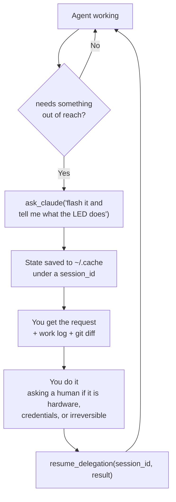
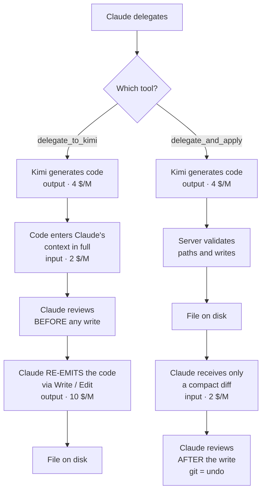
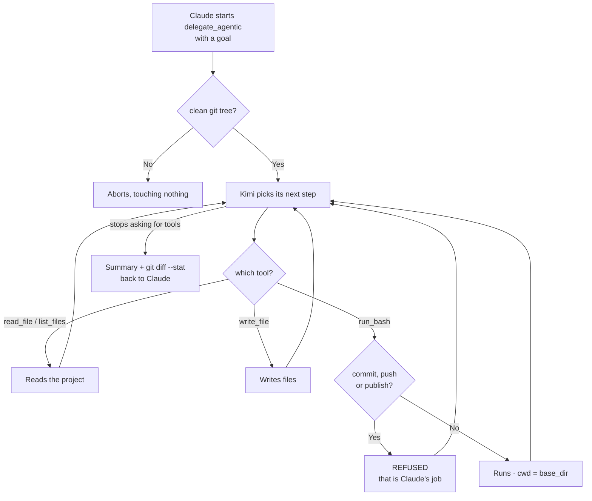
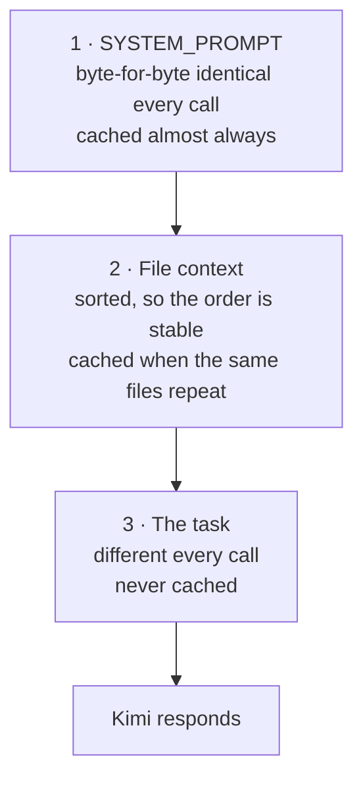

# kimi-delegate-mcp

An MCP server that lets Claude Code delegate programming work to
[Kimi K2.7-code](https://platform.moonshot.ai) (Moonshot AI) — from generating a
single file to turning it loose as an autonomous agent that writes code, runs
the tests and fixes itself — while Claude stays the orchestrator and decides
what gets committed.

Three tools, three levels of trust, chosen per task:

| Tool | What it does | Kimi's reach |
|---|---|---|
| `delegate_to_kimi` | Returns proposed code as text | Nothing — text only |
| `delegate_and_apply` | Writes the files, returns a diff | Writes inside one directory |
| `delegate_agentic` | Explores, edits, runs tests, self-corrects in a loop | Shell, inside one project |
| `resume_delegation` | Answers a paused agent and resumes it | — it is how *you* reply |

---

## Requirements

- **Python 3.10+**
- **[Claude Code](https://claude.com/claude-code)**
- **git** — the write-capable tools require a clean working tree, and use it as
  the undo path
- A **Moonshot API key** (pay-as-you-go; see below)

## Setup

### 1. Get an API key

Sign up at **[platform.kimi.ai](https://platform.kimi.ai)**, open **API Keys**,
and create one. It is shown only once — copy it somewhere safe.

Billing is pay-as-you-go: $0.95 per million input tokens ($0.19 cached), $4.00
per million output. A small delegation costs well under a cent; the loops in
`delegate_agentic` run to a few cents. A few dollars of credit goes a long way.

> **Never put the key in this repository.** It is passed as an environment
> variable at registration time (step 3) and stored in Claude Code's own
> config, outside the repo. `.gitignore` already excludes `.env` and key files,
> but the server never reads a key from disk in the first place — only from the
> `MOONSHOT_API_KEY` environment variable.

### 2. Install

```bash
git clone <this-repo-url>
cd kimi-delegate-mcp
python3 -m venv .venv
.venv/bin/pip install -r requirements.txt
```

### 3. Register with Claude Code

Use **absolute paths** — Claude Code launches this as a subprocess and does not
resolve relative ones:

```bash
claude mcp add kimi-delegate -s user \
  -e MOONSHOT_API_KEY=your-key-here \
  -- "$(pwd)/.venv/bin/python" "$(pwd)/server.py"
```

`-s user` makes it available in every project. Use `-s local` to limit it to
the current one.

### 4. Restart Claude Code, then verify

```bash
claude mcp list
```

You should see `kimi-delegate: ... - ✔ Connected`.

> **The restart is not optional.** Claude Code starts MCP servers when the
> session begins. A server registered mid-session does not appear — not even in
> `/mcp` — and edits to `server.py` or to its environment are not picked up
> until you restart. To test changes without restarting, import `server.py` in
> a script and call the function directly, bypassing the MCP layer.

---

## The tools

### Code you can verify yourself

A delegated model that finishes when its own tests go green is marking its own
homework — and cheap models are known to write tests that pass without testing
anything. So all three modes require **injectable seams** rather than trusted
tests: pure functions where possible, side effects (network, disk, clock,
randomness) behind parameters instead of buried in the logic, no hidden global
state.

`delegate_agentic` also leaves the test infrastructure standing and must report
the exact command to run the tests, the seams it left, and what stayed hard to
test.

Verified on a task with real side effects — "fetch the weather for a city and
report it with a timestamp". It produced:

```python
def report(city: str, *, fetch=None, now=None) -> str:
```

plus a `conftest.py` with a fake-HTTP factory and a frozen clock. Six
independently written tests — covering cases it had *not* anticipated, such as
the `results` key being absent rather than empty, and URL-encoding of accented
city names — all passed against those seams, without touching its code.

It holds up where it matters most, too. Given an ESP32 blink-in-morse task with
no board attached, it pulled the logic into a `MorsePlayer<IO>` template with
the I/O injected, stubbed the Arduino API, and left five host-side tests —
timing assertions included — that run on a development machine with no hardware
present. For embedded work that is the difference between testable and not.

### Reporting

All three report tokens in/out, how many were cache hits, how many went to the
model's reasoning, and the estimated cost:

```
_Kimi K2.7-code · 1572 tokens in (1536 cached) / 460 tokens out, 101 reasoning · ~$0.00065_
```

`delegate_agentic` reports the same totals across the whole loop, with the cache
hit rate as a percentage — the number worth watching there, since a loop resends
its history on every turn.

### `delegate_to_kimi(task, file_paths=[], extra_context="")`

Returns Kimi's proposed code as text. Review it, then apply it yourself.

Safest, but it has a cost trap: applying the code means re-emitting it through
Write/Edit, so **the same code is billed twice** — once as Kimi output at $4/M,
again as Claude output at $10/M. Over a whole project that inversion can make
delegating *more* expensive than not delegating at all.

### `delegate_and_apply(task, base_dir, file_paths=[], extra_context="")`

Writes the files itself and returns only a compact diff. Claude never re-emits
the code, so the second charge disappears — **measured 82% lower Claude-side
cost** on a two-file task, and the gap widens on edits to large existing files.

Review moves from *before* the write to *after* it. Use it on a clean git tree.

The model's output is untrusted input — it chooses these paths — so every one is
resolved and checked before anything is written:

| Path from model | Result |
|---|---|
| `ok/file.py` | written |
| `../escape.py` | refused — outside `base_dir` |
| `/etc/passwd`, `~/x.py` | refused — absolute |
| `.env`, `a/credentials.json` | refused — sensitive filename |
| ANSI codes or markdown around the path | stripped, then checked |
| empty after cleaning | refused — would resolve to `base_dir` itself |

### `delegate_agentic(task, base_dir, extra_context="", max_turns=25)`

Kimi gets four tools — `read_file`, `write_file`, `list_files` and `run_bash`
(with `cwd` set to `base_dir`) — and runs its own loop: explore, edit, run the
tests, see them fail, fix, repeat.

This is what K2.7-code is actually built for; it scores above Opus 4.8 on
tool-use benchmarks, and one-shot generation wastes that.

State the finish condition in the task ("until `pytest` passes"), and give it a
clean git tree.

**Commits, pushes and publishing are refused** — those belong to the human and
to Claude, not to a delegated agent. So are the git commands that would destroy
the working tree the whole design relies on for undo:

| Command | Result |
|---|---|
| `pytest -q`, `python -m pytest` | allowed |
| `git status`, `git diff`, `git log` | allowed — read-only git |
| `git commit`, `git push`, `gh pr create` | refused |
| `ls && git push origin main` | refused — chained commands are caught |
| `git reset --hard`, `git checkout`, `git clean` | refused |
| `npm publish`, `twine upload` | refused |

> ⚠️ **This is a workflow guard, not a sandbox.** `run_bash` takes a shell
> string and the `cwd` confinement is a convenience, not a cage — a command can
> leave the directory with an absolute path. It stops accidents, not attacks.
> Only point it at projects where that is acceptable.

Before the loop starts, the server probes the environment once — interpreter
version, whether pytest is importable, any existing venv, project files, tests
already present — and states it in the prompt, so the agent does not spend turns
rediscovering it (see [Why loops cost more](#why-loops-cost-more) for what that
buys).

Other limits: aborts unless the tree is clean, caps the loop at `max_turns`,
times commands out at 120 s, clips tool output to 4,000 characters — keeping
*both ends* for shell output, since test runners put the verdict on the last
line — and returns `git diff --stat` plus any new untracked files at the end.

**Expect it to take liberties.** In testing it created a 28 MB virtualenv inside
the project, unprompted, to install pytest after the system one was missing.
That was reasonable and it got the tests passing — but review the directory, not
just the diff.

### `resume_delegation(session_id, result)`

Confined to one directory and barred from committing, the agent would otherwise
have no way to handle work that needs the outside world — flashing a board,
reading a serial port, someone looking at an LED. It would only be able to give
up or invent a result.

So it gets a fifth tool of its own, `ask_claude`. Calling it **suspends the
loop**: state is written to `~/.cache/kimi-delegate/sessions/`, and the request
comes back to you along with the work so far and the diff. Do the thing, then
call `resume_delegation` with what you observed — the same session continues
with its context intact.



Note that the agent does not gain any reach here — it gains a way to *ask*. You
stay the gate.

Be literal in `result`: paste the real output, or describe exactly what is
visible. Saying you *couldn't* do it is also a useful answer — it lets the agent
try another route instead of waiting.

> **Answer carefully, and check the work log first.** Given a report that
> contradicts its own correct code, this model does not push back — it
> improvises. In testing, a deliberately false observation ("dots and dashes
> look the same length") had it "fixing" the LED polarity, which has nothing to
> do with duration, on code whose timings were already correct *and* covered by
> a passing test it had written. If your answer contradicts what it has built,
> say so explicitly rather than letting it guess.

Session ids are generated server-side and validated on the way back in, since
they return as an argument. Sessions expire after 24 hours, and the saved file
is removed on resume so the same pause cannot be answered twice.

---

## How it works

The first two tools differ in **who writes the file**, and that is where the
cost is decided:



The box that explains everything is **"Claude RE-EMITS the code"**: on the
review-first path the same code is billed twice. The direct-write path removes
the second charge entirely.

`delegate_agentic` works differently — a loop, not a reply:



### Prefix caching

Moonshot bills repeated prompt prefixes at $0.19/M instead of $0.95/M — an 80%
discount on input. Caching is automatic (no `cache_id` to manage; the explicit
`POST /v1/caching` API is legacy `moonshot-v1` only), but it only works if the
prefix is genuinely stable:

- The prompt must exceed **256 tokens** or nothing is cached.
- Matching is **by prefix**, aligned to 256-token blocks. One changed byte and
  everything after it stops being cached.

So the prompt is built **stable first, variable last**:



Put the task first and the prefix diverges on the third token, so nothing is
ever cached. Measured, two calls sharing a file context:

| | Tokens in | Cached | Cost |
|---|---|---|---|
| Call 1 (cold) | 1,573 | 0 | $0.00184 |
| Call 2 (same prefix) | 1,572 | **1,536 (98%)** | **$0.00065** |

The discount applies to **input only**. On small one-off tasks the output
dominates the bill, so caching barely helps; it pays off across several
delegations over the same large context.

### Why loops cost more

The API is stateless: every call resends the whole conversation, so a loop's
input grows each turn and the earliest tokens end up billed ten times over. A
one-shot delegation runs about $0.003; an agentic loop runs $0.02–0.03. Not that
the agent does ten times the work — there are just many more, and progressively
larger, requests.

Prefix caching is doing a lot of work here, because that repeated history is
exactly what it is for. Measured on a real loop: **18,432 of 22,948 input tokens
cached (80%)**, which took the run from $0.034 to $0.020 — a 41% saving.

> **So do not trim the history to save money.** It is the obvious instinct and it
> backfires: cutting from the middle changes the prefix, and everything after the
> cut stops being cached.

Where the money actually is, once caching is applied:

| | Cost | Share |
|---|---|---|
| Input (80% cached) | $0.0078 | 39% |
| Output | $0.0121 | **61%** |

Output is the larger half and caching does not touch it. The only real lever
left is **spending fewer turns** — each turn costs its own output (reasoning
included) *and* then rides along in every later request. Hence the environment
probe: on one run, four of eleven turns went on discovering that `python` was
not on PATH, that pytest was missing, and building a virtualenv. Handing that
over up front, on the same task:

| | Before | After | |
|---|---|---|---|
| Tool calls | 11 | **8** | −27% |
| Tokens in | 22,948 | 18,604 | −19% |
| Tokens out | 3,035 | 2,291 | −25% |
| Cost | $0.0199 | **$0.0161** | −19% |

No loss of quality — 19 generated tests, all passing. The environment block sits
ahead of the task so it stays inside the cacheable prefix.

Runs that pause and resume are the expensive case: each resume restarts from the
whole accumulated history. The ESP32 session above reached **$0.127 over 24
calls** — still small change, but roughly six times a straightforward loop.

### Model behaviour worth knowing

Verified against the live API, not just the docs:

| | Reality | Consequence |
|---|---|---|
| Thinking | Always on, **cannot be disabled** | Billed as output and counts against `max_tokens` |
| Temperature | **Ignored** — fixed sampling | Nothing to tune |
| `reasoning_effort` | K3 only | Not applicable |
| Output ceiling | Accepts ≥131,072 | The budget here is 32,000 |

Reasoning is not a rounding error: on a moderate task it was **2,314 of 3,635
completion tokens (64%)**. A budget sized for the code alone truncates it — and
a truncated reply leaves its last file block unclosed, so a naive parser drops
it silently. Both write-capable tools check `finish_reason` and refuse to apply
a truncated reply.

Multi-turn tool loops must feed the assistant turn back **including
`reasoning_content`**, or Moonshot rejects the following request.

---

## Notes on model choice

Kimi K2.7-code is the cheap-model pick here, not a claim that it beats better
models. It doesn't: Sonnet 5 leads it on SWE-bench Verified (85.2% vs a
self-reported 60.4%) and on SWE-bench Pro. K2.7's published gains over K2.6 come
entirely from Moonshot's own benchmarks with no independent verification — and
its SWE-bench Verified score is actually *lower* than K2.6's.

What earns it the slot is that in independent testing K2.6 was the one cheap
model that wrote tests that actually tested something, rather than mocking
classes that don't exist. K2.7-code is its coding-specialist fine-tune. Treat
its benchmark numbers as provisional; treat review as mandatory.

## Data residency

Moonshot does not specify a hosting country, and its policy permits training on
submitted data with no documented opt-out. Everything the model reads leaves
your machine irreversibly — and in agentic mode, *it* chooses what to read.

Do not point this at code covering other people's personal data. Under GDPR that
is an international transfer to a country with no adequacy decision.

## Troubleshooting

| Symptom | Cause |
|---|---|
| Tool doesn't appear in Claude Code | Server registered mid-session — restart Claude Code |
| `MOONSHOT_API_KEY no está definida` | Key missing from the registration; re-run `claude mcp add` with `-e` |
| Edits to `server.py` have no effect | The running session still has the old subprocess — restart |
| `ABORTADO ... repo git limpio` | Uncommitted changes, often just `__pycache__`. Commit, stash, or gitignore them |
| `ABORTADO: ... finish_reason='length'` | The task was too big for one reply. Split it up |
| `No hay ninguna delegación pausada con id ...` | The session expired (24 h) or was already resumed. Start a fresh delegation |

## License

MIT
