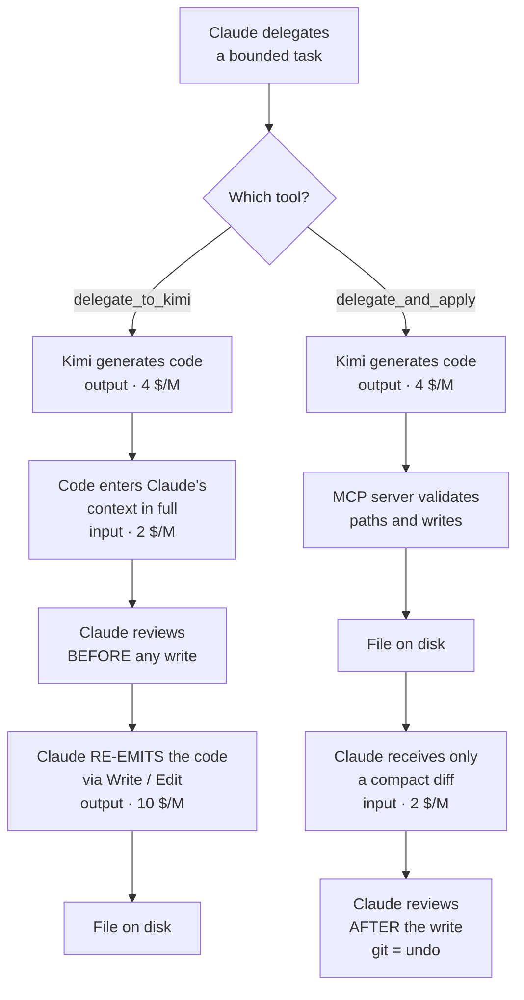
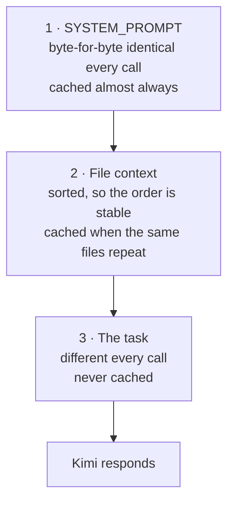

# kimi-delegate-mcp

An MCP server that lets Claude Code delegate bounded coding tasks to
[Kimi K2.7-code](https://platform.moonshot.ai) (Moonshot AI), while Claude stays
the orchestrator and reviews every result.

Claude decides on its own when a task is worth delegating — repetitive work,
writing code from a clear spec, mechanical refactors — calls Kimi as a tool,
and reviews the proposed code before applying it.

## Design

**Kimi never touches your machine.** The server sends text (the task plus any
file context Claude chose to pass) to the Moonshot API and returns text
(proposed code). Applying changes is Claude's job, with its own Write/Edit
tools, after review. That review gate is the whole point: cheap models are
known to write tests that pass without testing anything, so nothing lands
unreviewed.

Files whose names look sensitive (`.env`, `credentials`, `*.pem`, `*.key`, …)
are refused before anything leaves the machine.

## Prefix-caching optimization

Moonshot bills repeated prompt prefixes at $0.19/M instead of $0.95/M — an 80%
discount on input. The caching is automatic (no `cache_id` to manage; the
explicit `POST /v1/caching` API is legacy `moonshot-v1` only), but it only
works if the prefix is actually stable:

- The prompt must exceed **256 tokens** or nothing is cached.
- Matching is **by prefix**, aligned to 256-token blocks. One changed byte and
  everything after it stops being cached.

So the prompt is built **stable first, variable last**:

1. A fixed `system` message — byte-for-byte identical on every call.
2. File context, with `sorted(file_paths)` so the same set of files always
   produces the same prefix regardless of the order they were passed in.
3. The task — the only part that varies — last.

Getting this backwards (task first) means the prefix diverges on the first
token and *nothing is ever cached*. Measured, two calls sharing a file context:

| | Tokens in | Cached | Cost |
|---|---|---|---|
| Call 1 (cold) | 1,573 | 0 | $0.00184 |
| Call 2 (same prefix) | 1,572 | **1,536 (98%)** | **$0.00065** |

**65% cheaper on the second call.**

Worth calibrating expectations: the discount applies to **input only**. On small
one-off tasks the output dominates the bill (in one real delegation, 94% of the
cost), so caching barely helps there. It pays off when you make several
delegations over the same large file context.

## Setup

```bash
git clone https://github.com/JMcordobamendez/kimi-delegate-mcp.git
cd kimi-delegate-mcp
python3 -m venv .venv
.venv/bin/pip install -r requirements.txt
```

Get an API key from [platform.kimi.ai](https://platform.kimi.ai), then register
the server with Claude Code:

```bash
claude mcp add kimi-delegate -s user \
  -e MOONSHOT_API_KEY=sk-your-key-here \
  -- /absolute/path/to/.venv/bin/python /absolute/path/to/server.py
```

Restart Claude Code, and check it connected:

```bash
claude mcp list
```

> **Note:** Claude Code launches the MCP server as a subprocess at session
> start. Changes to `server.py` or to the server's environment are **not**
> picked up by a running session — restart it. To test changes without
> restarting, import `server.py` in a script and call the function directly,
> bypassing the MCP layer.

## How a delegation flows

Claude stays the orchestrator throughout: it decides what to delegate, builds
the context, and reviews. The two tools differ in **who writes the file**, and
that is where the cost is decided:



The box that explains everything is **"Claude RE-EMITS the code"**: on the
review-first path the same code is billed twice — once as Kimi output, again
as Claude output at 2.5x the price. The direct-write path removes that second
charge entirely.

### Prompt layout (and why the order matters)



Put the task first — as the original version did — and the prefix diverges on
the third token, so nothing is ever cached.

## The tools

Both report tokens in/out, how many were cache hits, and the estimated cost —
so cache behaviour can be verified rather than assumed.

### `delegate_to_kimi(task, file_paths=[], extra_context="")`

Returns Kimi's proposed code as text. Review it, then apply it yourself.

Safer, but it has a cost trap: applying the code means re-emitting it through
Write/Edit, so **the same code is billed twice** — once as Kimi output at
$4/M, again as Claude output at $10/M. On a whole project that inversion can
make delegating *more* expensive than not delegating at all.

### `delegate_and_apply(task, base_dir, file_paths=[], extra_context="")`

Writes the files itself and returns only a compact diff. Claude never
re-emits the code, so the second charge disappears — **measured 82% lower
Claude-side cost** on a small two-file task, and the gap widens on edits to
large existing files, where the diff is far smaller than the file.

The trade-off is real: review moves from *before* the write to *after* it.
Use it on a clean git tree, and treat `git diff` / `git checkout` as the undo
mechanism.

The model's output is untrusted input — it chooses these paths — so every one
is resolved and checked before anything is written:

| Path from model | Result |
|---|---|
| `ok/file.py` | written |
| `../escape.py` | refused — outside base_dir |
| `/etc/passwd` | refused — absolute |
| `~/x.py` | refused — absolute |
| `.env`, `a/credentials.json` | refused — sensitive filename |

The caller is also warned when `base_dir` isn't a git repo, or already had
uncommitted changes that the write would get mixed into.

## Notes on model choice

Kimi K2.7-code is the cheap-model pick here, not a claim that it beats better
models. It doesn't: Sonnet 5 leads it on SWE-bench Verified (85.2% vs a
self-reported 60.4%) and on SWE-bench Pro. K2.7's published gains over K2.6 come
entirely from Moonshot's own benchmarks and have no independent verification —
and its SWE-bench Verified score is actually *lower* than K2.6's.

What earns it the slot is that in independent testing K2.6 was the one cheap
model that wrote tests that actually tested something, rather than mocking
classes that don't exist. K2.7-code is its coding-specialist fine-tune. Treat
its benchmark numbers as provisional; treat the review gate as mandatory.

## Data residency

Moonshot does not specify a hosting country, and its policy permits training on
submitted data with no documented opt-out. Don't send code covering third
parties' personal data through this — under GDPR that's an international
transfer to a country with no adequacy decision.

## License

MIT
